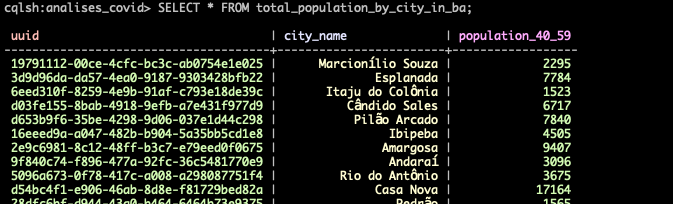
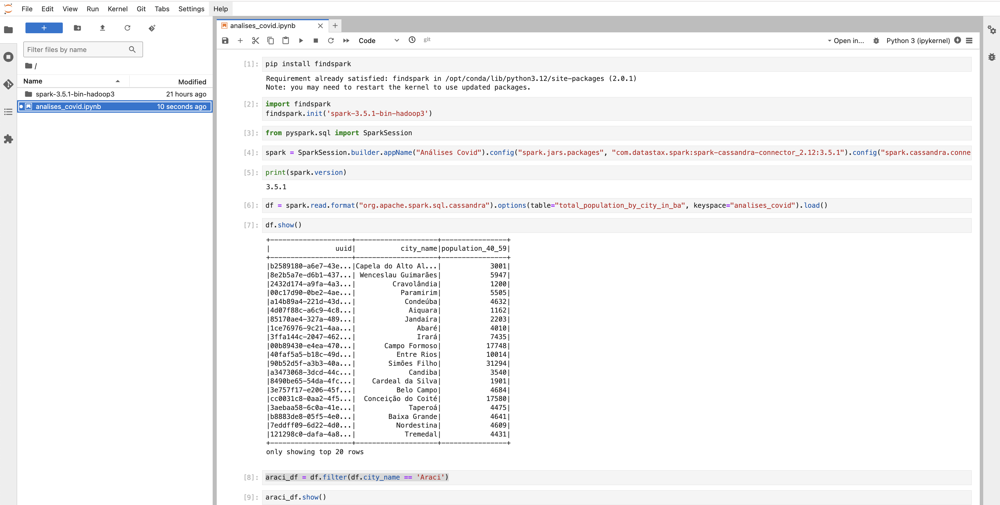

## Cassandra infrastructure project

This a data engineering and data analysis project to showcase Cassandra. To run this
project you need [Docker](https://www.docker.com/) and [Poetry](https://python-poetry.org/).
It runs on Python `3.11`. If you need to change Python versions it's recommended to
use [pyenv](https://github.com/pyenv/pyenv).

Run this command to generate the proper data:

```bash
make etl
```

This will generate two `.csv` files in the `./data/` folder. Now setup Docker:

```bash
make setup
```

Then run services (Cassandra and Jupyter):

```bash
make up
```

Enter the `cassandra1` container:

```bash
make cas
```

**Wait a bit for the Cassandra containers to finish setting up**. If you try to enter the
`cqlsh` tool too soon it will show this error message:

```bash
Connection error: ('Unable to connect to any servers', {'127.0.0.1:9042': ConnectionRefusedError(111, "Tried connecting to [('127.0.0.1', 9042)]. Last error: Connection refused")})
```

After waiting a bit, in the Cassandra container, enter `cqlsh`:

```bash
cqlsh
```

Then create the keyspace and use it:

```bash
CREATE KEYSPACE IF NOT EXISTS analises_covid WITH REPLICATION = { 'class': 'SimpleStrategy', 'replication_factor': 2 };
```

```bash
USE analises_covid;
```

Create the necessary tables:

```bash
CREATE TABLE IF NOT EXISTS total_population_by_city_in_ba (city_name TEXT, uuid UUID, population_40_59 INT, PRIMARY KEY (uuid, city_name));
```

```bash
CREATE TABLE IF NOT EXISTS vaccinated_people_by_city_in_ba (city_name TEXT, vaccinated_people_d1_40_59 INT, uuid UUID, PRIMARY KEY (uuid, city_name));
```

Copy the data generated by the Python script to the created tables:

```bash
COPY analises_covid.total_population_by_city_in_ba (city_name,uuid,population_40_59) FROM './data/people_40_59_by_city_ba.csv' WITH HEADER=true;
```

```bash
COPY analises_covid.vaccinated_people_by_city_in_ba (city_name,vaccinated_people_d1_40_59,uuid) FROM './data/people_40_59_covid_d1_by_city_ba.csv' WITH HEADER=true;
```

To check the tables with the copyied data, run:

```bash
SELECT * FROM total_population_by_city_in_ba;
```

You'll hopefully see something like this:



Access Jupyter on your browser in http://localhost:8888/. Then get the Jupyter token:

```bash
make jup
```

Put the token in the Jupyter input:


Open the notebook `/jupyter/analises_covid.ipynb` inside the Jupyter lab and run the
commands in each cell to see the analysis on the created database.



If you want to stop all services:

```bash
make down
```
